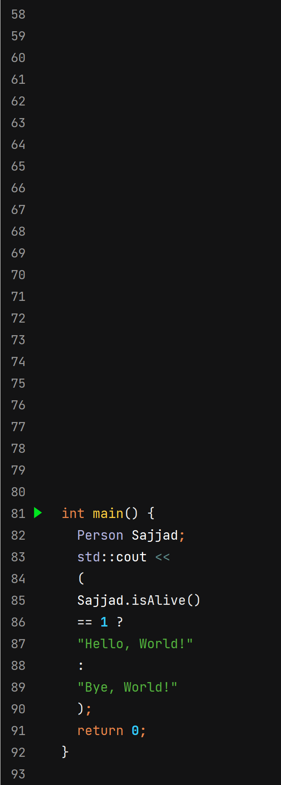
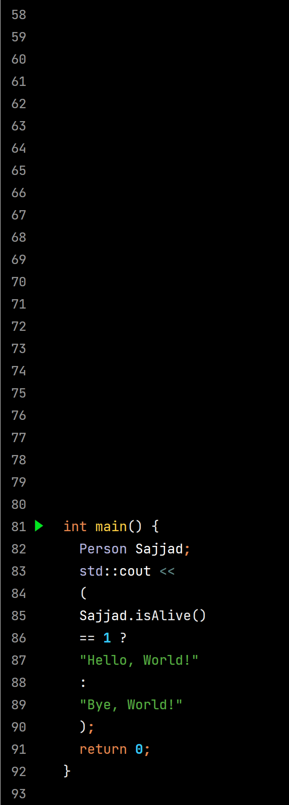

# Selective Color Replacement

This repository contains MATLAB code for selectively replacing specific color ranges in images with white. It provides a way to enhance image processing by targeting and modifying specific colors.

## Code Example

```matlab
imgg = imread('mm.jpg');

% Color Replacement Code...

imshow(imgg)

```

## Example Results

| Before Color Replacement | After Color Replacement |
|---|---|
|  |  |

## How to Use

1. Clone the repository.
2. Open MATLAB and navigate to the repository folder.
3. Modify the mm.jpg file path in the code with your own image file.
4. Run the MATLAB script.
5. View the modified image using the imshow function.
6. Adjust the color range values in the code to customize the color replacement.

Feel free to experiment with different color ranges and explore the impact of selective color replacement on your images!

## License

This project is licensed under the [MIT License](LICENSE).
